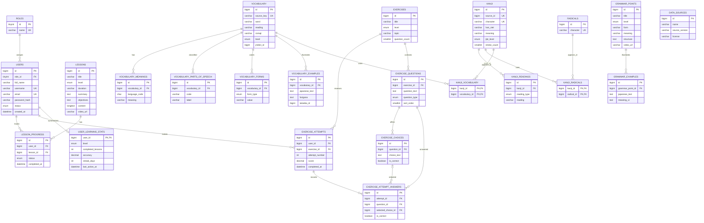

# ERD — Nihongo Learning

```mermaid
erDiagram
  ROLES ||--o{ USERS : assigns
  USERS ||--o{ LESSON_PROGRESS : tracks
  LESSONS ||--o{ LESSON_PROGRESS : has
  USERS ||--o{ EXERCISE_ATTEMPTS : makes
  EXERCISES ||--o{ EXERCISE_ATTEMPTS : receives
  EXERCISES ||--o{ EXERCISE_QUESTIONS : contains
  EXERCISE_QUESTIONS ||--o{ EXERCISE_CHOICES : offers
  EXERCISE_ATTEMPTS ||--o{ EXERCISE_ATTEMPT_ANSWERS : records
  EXERCISE_QUESTIONS ||--o{ EXERCISE_ATTEMPT_ANSWERS : answered
  EXERCISE_CHOICES o|--o{ EXERCISE_ATTEMPT_ANSWERS : selected
  USERS ||--o| USER_LEARNING_STATS : summarizes
  VOCABULARY ||--o{ VOCABULARY_MEANINGS : has
  VOCABULARY ||--o{ VOCABULARY_PARTS_OF_SPEECH : classified
  VOCABULARY ||--o{ VOCABULARY_FORMS : varies
  VOCABULARY ||--o{ VOCABULARY_EXAMPLES : illustrates
  KANJI ||--o{ KANJI_READINGS : read_as
  KANJI ||--o{ KANJI_RADICALS : uses
  RADICALS ||--o{ KANJI_RADICALS : appears_in
  KANJI ||--o{ KANJI_VOCABULARY : appears_in
  VOCABULARY ||--o{ KANJI_VOCABULARY : uses
  GRAMMAR_POINTS ||--o{ GRAMMAR_EXAMPLES : illustrates

  ROLES {
    tinyint id PK
    varchar name UK
  }
  USERS {
    bigint id PK
    tinyint role_id FK
    varchar full_name
    varchar username UK
    varchar email UK
    varchar password_hash
    enum status
    datetime created_at
  }
  VOCABULARY {
    bigint id PK
    varchar source_key UK
    varchar word
    varchar reading
    varchar romaji
    enum level
    bigint jmdict_id
  }
  VOCABULARY_MEANINGS {
    bigint id PK
    bigint vocabulary_id FK
    char language_code
    varchar meaning
  }
  VOCABULARY_PARTS_OF_SPEECH {
    bigint id PK
    bigint vocabulary_id FK
    varchar code
    varchar label
  }
  VOCABULARY_FORMS {
    bigint id PK
    bigint vocabulary_id FK
    enum form_type
    varchar value
  }
  VOCABULARY_EXAMPLES {
    bigint id PK
    bigint vocabulary_id FK
    text japanese_text
    text furigana
    bigint tatoeba_id
  }
  KANJI {
    bigint id PK
    bigint source_id UK
    varchar character UK
    varchar han_viet
    varchar meaning
    enum jlpt_level
    smallint stroke_count
  }
  KANJI_READINGS {
    bigint id PK
    bigint kanji_id FK
    enum reading_type
    varchar reading
  }
  RADICALS {
    bigint id PK
    varchar character UK
  }
  KANJI_RADICALS {
    bigint kanji_id PK, FK
    bigint radical_id PK, FK
  }
  KANJI_VOCABULARY {
    bigint kanji_id PK, FK
    bigint vocabulary_id PK, FK
  }
  LESSONS {
    bigint id PK
    varchar title
    enum level
    varchar duration
    text summary
    text objectives
    longtext content
    varchar video_url
  }
  LESSON_PROGRESS {
    bigint id PK
    bigint user_id FK
    bigint lesson_id FK
    enum status
    datetime completed_at
  }
  GRAMMAR_POINTS {
    bigint id PK
    varchar title
    enum level
    varchar form
    varchar meaning
    text structure
    varchar video_url
  }
  GRAMMAR_EXAMPLES {
    bigint id PK
    bigint grammar_point_id FK
    text japanese_text
    text meaning_vi
  }
  EXERCISES {
    bigint id PK
    varchar title
    enum level
    varchar topic
    smallint question_count
  }
  EXERCISE_QUESTIONS {
    bigint id PK
    bigint exercise_id FK
    text question_text
    enum question_type
    smallint sort_order
  }
  EXERCISE_CHOICES {
    bigint id PK
    bigint question_id FK
    text choice_text
    boolean is_correct
  }
  EXERCISE_ATTEMPTS {
    bigint id PK
    bigint user_id FK
    bigint exercise_id FK
    int attempt_number
    decimal score
    datetime completed_at
  }
  EXERCISE_ATTEMPT_ANSWERS {
    bigint id PK
    bigint attempt_id FK
    bigint question_id FK
    bigint selected_choice_id FK
    boolean is_correct
  }
  USER_LEARNING_STATS {
    bigint user_id PK, FK
    enum level
    int completed_lessons
    decimal accuracy
    int streak_days
    datetime last_active_at
  }
  DATA_SOURCES {
    bigint id PK
    varchar name
    varchar source_version
    varchar license
  }
```
